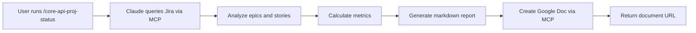

# Strategic Plan: Automated Status Reporting with Claude AI

**Last Updated:** March 23, 2026
**Author:** Shai Ghinsburg

## Vision

Leverage Claude AI to automate project status reporting, transforming a time-consuming manual process into an efficient, consistent, and data-driven workflow. By integrating Claude with project management tools (Jira) and collaboration platforms (Google Docs), we can generate comprehensive status reports on-demand with a single command.

## Problem Statement

Traditional status reporting requires:
- Manual data collection from multiple sources (Jira, GitHub, Confluence)
- Time-consuming analysis of progress metrics
- Repetitive formatting and document creation
- Risk of inconsistency and human error
- Significant time investment (2-4 hours per report)

## Solution: Claude-Powered Automation

### Core Components

1. **Claude Code CLI**
   - Terminal-based interface for Claude AI
   - Support for skills (reusable workflows)
   - MCP (Model Context Protocol) server integration

2. **MCP Servers**
   - **Atlassian MCP**: Direct access to Jira for querying epics and stories
   - **Google MCP**: Access to Google Drive and Docs for report generation
   - Secure, authenticated access to enterprise tools

3. **Skills Architecture**
   - Reusable, shareable workflows
   - YAML-based configuration
   - Git-backed for version control and collaboration

### How It Works



1. User invokes the skill: `/core-api-proj-status`
2. Claude reads configuration from `~/.claude/bizfilings-pm-config.json`
3. Claude queries Jira for epics and stories using JQL
4. Claude calculates progress metrics, identifies blockers
5. Claude generates a formatted markdown report
6. Claude creates a new Google Doc with the report
7. User receives the document URL

## Benefits

### Time Savings
- **Before:** 2-4 hours per week for manual report generation
- **After:** 30 seconds to generate a comprehensive report
- **Annual savings:** ~100-200 hours of PM time

### Consistency
- Standardized report format
- No missed information
- Same structure every time
- Reliable metric calculations

### Data-Driven Insights
- Real-time data from Jira
- Accurate progress percentages
- Automatic blocker detection
- Trend analysis (future enhancement)

### Scalability
- Easy to replicate for other projects
- Can run reports for multiple projects simultaneously
- Consistent process across teams

## Architecture Decisions

### Skills vs Agents

**Agents** (`~/.claude/agents/`):
- ✅ Good for prototyping and experimentation
- ✅ Can be invoked with `@agent-name` in conversation
- ❌ Not easily shareable across team
- ❌ No built-in version control

**Skills** (`~/.claude/skills/`):
- ✅ Reusable workflows with `/skill-name` syntax
- ✅ Shareable via Git repository
- ✅ Version controlled
- ✅ Can be installed by entire team
- ✅ Better for production use

**Recommendation:** Use agents for prototyping, convert to skills for production.

### Configuration Management

Store configuration in `~/.claude/` directory:
- Keeps sensitive credentials out of the skills repo
- Allows per-user customization
- Easy to update without touching skill code
- Can be templated for team members

### Report Storage Strategy

Two approaches were evaluated:

1. **Single Document (Prepend/Append)**
   - ✅ All history in one place
   - ❌ Document grows large over time
   - ❌ Harder to find specific week's report
   - ❌ Collaboration conflicts when multiple people update

2. **New Document Each Time** (SELECTED)
   - ✅ Clean, focused reports
   - ✅ Easy to share specific week's report
   - ✅ No document size issues
   - ✅ No collaboration conflicts
   - ✅ Date-prefixed naming for easy sorting
   - ✅ Keeps history in Drive folder structure

## Expansion Strategy

### Single Generic Skill vs Project-Specific Skills

#### Option A: Single Generic Skill
```
/status-report --project=bizfilings
/status-report --project=other-project
```

**Pros:**
- One skill to maintain
- Consistent logic across projects
- DRY principle

**Cons:**
- Complex configuration
- Less customization per project
- One size fits all approach
- Harder to tailor report format

#### Option B: Project-Specific Skills
```
/core-api-proj-status
/other-project-status
```

**Pros:**
- Tailored to each project's needs
- Custom report formats
- Project-specific metrics
- Simpler configuration
- Easier to understand

**Cons:**
- More files to maintain
- Potential code duplication
- Must update multiple skills for common improvements

**Recommendation:** Start with project-specific skills (Option B)
- Easier to iterate and customize
- Extract common patterns into shared utilities later
- Can always refactor to generic skill once patterns are clear
- Current implementation proves value quickly

### Success Metrics

Track these metrics to measure effectiveness:

1. **Time Savings**
   - Time spent on manual reporting (before)
   - Time spent with automation (after)
   - Adoption rate across team

2. **Consistency**
   - Reports generated on schedule
   - Report quality and completeness
   - Reduction in follow-up questions

3. **Adoption**
   - Number of team members using skills
   - Number of projects with automated reporting
   - Frequency of report generation

4. **Value**
   - Decisions made faster due to better visibility
   - Issues caught earlier
   - Stakeholder satisfaction

## Rollout Plan

### Phase 1: Pilot (Current) ✓
- Single project (Core API)
- Single user (PM)
- Prove value and refine

### Phase 2: Team Expansion (Next)
- Share skills repository with team
- Create installation guide
- Support additional users
- Gather feedback

### Phase 3: Multi-Project (Future)
- Replicate for other projects
- Extract common patterns
- Build template for new projects
- Create project-specific customizations

### Phase 4: Organization-Wide (Long-term)
- Deploy across all engineering teams
- Integrate with other workflows
- Add advanced analytics
- Create executive dashboards

## Risk Mitigation

| Risk | Mitigation |
|------|------------|
| MCP server downtime | Graceful error handling, retry logic |
| API rate limits | Throttling, caching, batch requests |
| Credential security | Store in secure locations, use env vars |
| Data accuracy | Validate queries, spot-check reports |
| Skill maintenance | Version control, clear documentation |
| User adoption | Training, documentation, support |

## Next Steps

1. ✓ Document current implementation
2. Share with team for pilot expansion
3. Create feedback loop and iteration plan
4. Identify next project for automation
5. Build reusable templates and patterns
6. Measure and report on success metrics

## Resources

- **Skills Repository:** https://github.com/shaigh-lz/claude-skills
- **Claude Code CLI:** https://github.com/anthropics/claude-code
- **MCP Documentation:** https://modelcontextprotocol.io/
- **User Guides:** See `docs/` directory

---

*This is a living document. Update as strategy evolves and new learnings emerge.*
